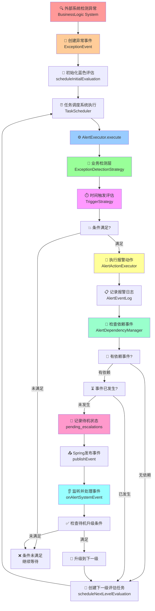
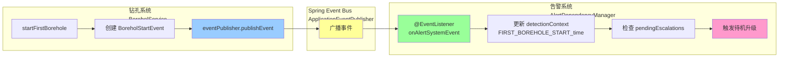
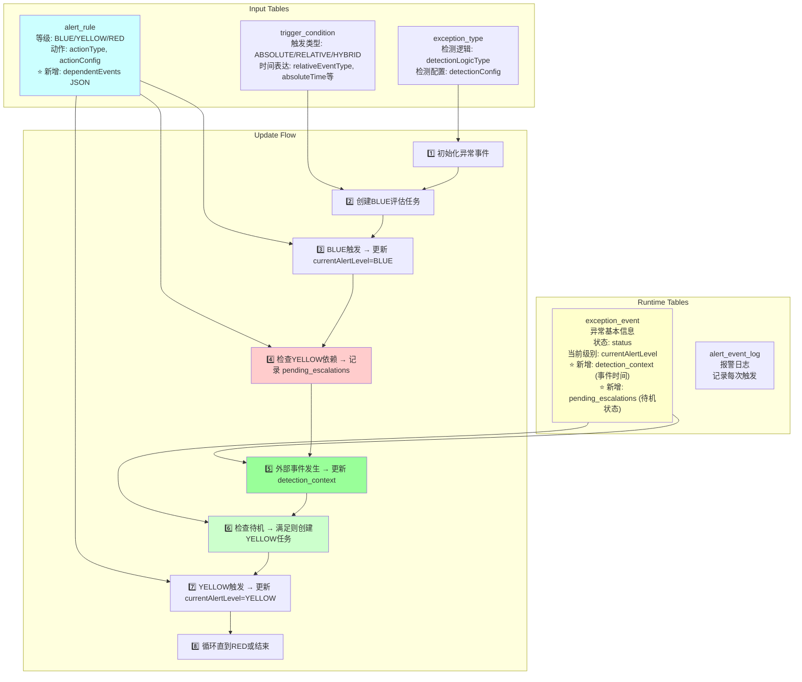
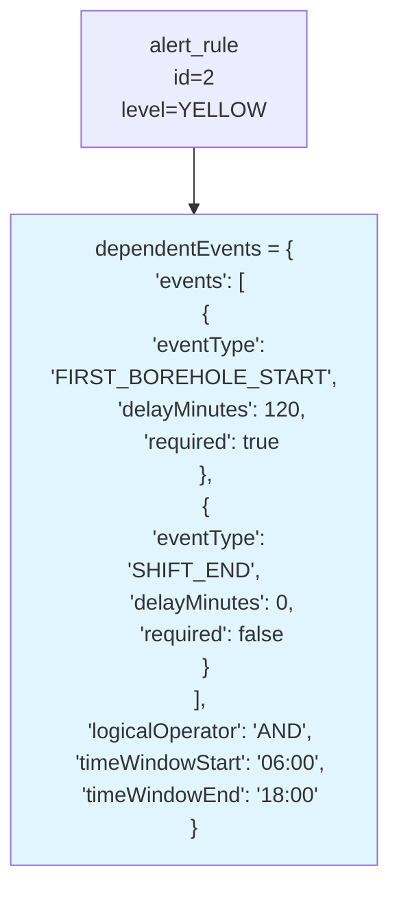
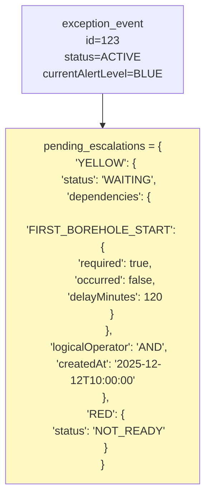
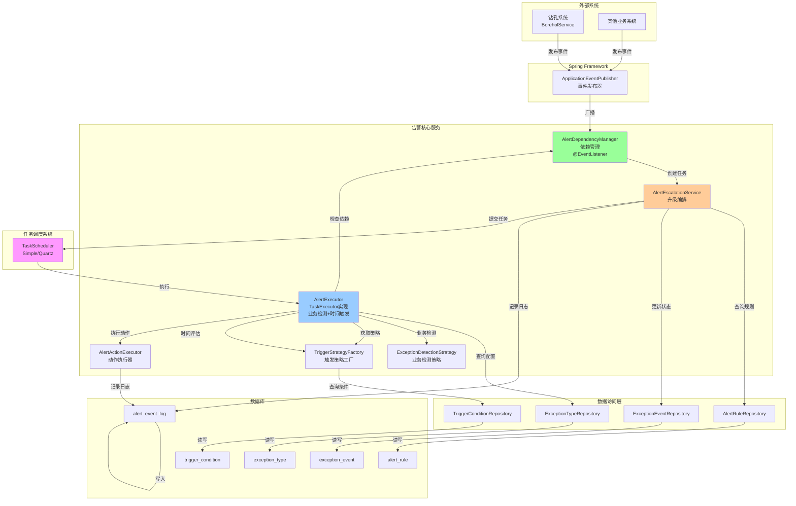
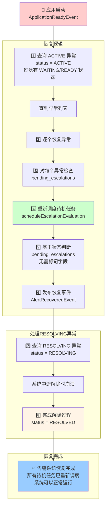
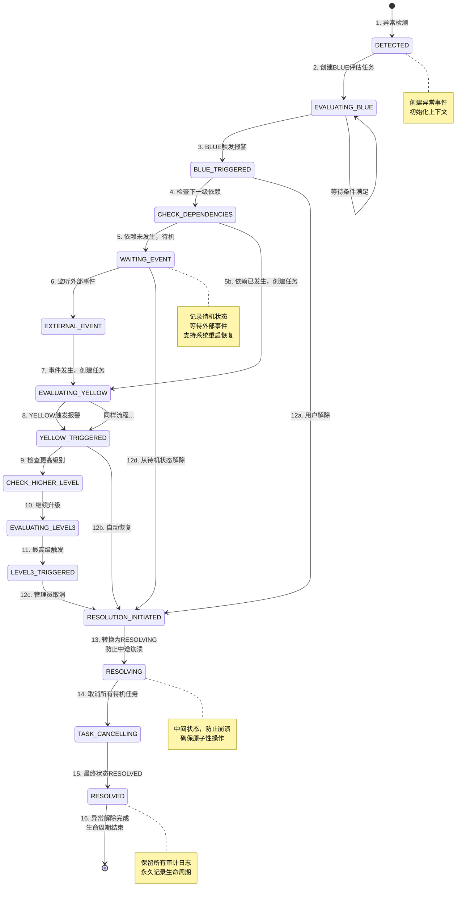

# Alert 模块完整数据流图

## 1. 整体系统流程图



---

## 2. 详细的蓝色→黄色→红色升级流程

```mermaid
graph LR
    subgraph "BLUE Level"
        B1["BLUE 评估任务"]
        B2["业务检测"]
        B3["时间条件"]
        B4["执行报警"]
    end

    subgraph "YELLOW Dependency Check"
        Y1["检查黄色依赖<br/>FIRST_BOREHOLE_START?"]
        Y2a["依赖已发生<br/>→ 立即创建YELLOW任务"]
        Y2b["依赖未发生<br/>→ 记录待机状态"]
    end

    subgraph "Waiting for External Event"
        W1["exception_event.pending_escalations<br/>YELLOW: WAITING"]
        W2["钻孔系统发布事件"]
        W3["AlertDependencyManager监听"]
        W4["检查待机升级条件"]
        W5["满足 → 创建YELLOW任务"]
    end

    subgraph "YELLOW Level"
        YL1["YELLOW 评估任务"]
        YL2["业务检测"]
        YL3["时间条件"]
        YL4["执行报警"]
    end

    subgraph "RED Level"
        R1["RED 评估任务"]
        R2["业务检测"]
        R3["时间条件"]
        R4["执行报警"]
    end

    B1 --> B2 --> B3 --> B4
    B4 --> Y1
    Y1 --> Y2a
    Y1 --> Y2b
    Y2a --> YL1
    Y2b --> W1
    W1 --> W2
    W2 --> W3
    W3 --> W4
    W4 --> W5
    W5 --> YL1
    YL1 --> YL2 --> YL3 --> YL4
    YL4 --> R1
    R1 --> R2 --> R3 --> R4

    style B4 fill:#ffcccc
    style YL4 fill:#ffff99
    style R4 fill:#ff9999
    style W1 fill:#ffffcc
    style W5 fill:#ccffcc
```



---

## 3. 事件发布订阅流程（Spring Event）



---

## 4. 数据库表及更新流程



---

## 5. AlertRule 的 dependentEvents JSON 结构示例



---

## 6. ExceptionEvent 的 pending_escalations JSON 结构示例



---

## 7. 时间线示例：完整的升级过程

```mermaid
timeline
    title 异常报警完整升级时间线
    
    10:00 : 钻探系统检测异常 : 创建 ExceptionEvent
    10:00 : 初始化蓝色评估 : 创建 TaskType.ALERT 任务
    10:02 : 蓝色评估执行 : 业务检测通过 → 时间条件满足 → 触发蓝色报警
    10:02 : 检查黄色依赖 : 需要等待 FIRST_BOREHOLE_START 事件
    10:02 : 记录待机状态 : exception_event.pending_escalations[YELLOW] = WAITING
    10:30 : 钻孔系统：第一个钻孔开始 : 发布 BoreholStartEvent 事件
    10:30 : 告警系统监听事件 : 更新 detection_context[FIRST_BOREHOLE_START_time]
    10:30 : 检查待机升级 : pending_escalations[YELLOW] 依赖满足
    10:30 : 创建黄色评估任务 : TaskScheduler 调度
    10:32 : 黄色评估执行 : 业务检测通过 → 时间条件满足 → 触发黄色报警
    10:32 : 检查红色依赖 : 无依赖或依赖已满足
    10:32 : 创建红色评估任务 : TaskScheduler 调度
    11:00 : 红色评估执行 : 业务检测通过 → 触发红色报警（最高级）
```

---

## 8. 核心组件交互图



---

## 9. 关键数据结构汇总

### alert_rule 表
```
id | exceptionTypeId | triggerConditionId | level | actionType | actionConfig | dependent_events (JSON)
```

**dependent_events JSON**:
```json
{
  "events": [
    {
      "eventType": "FIRST_BOREHOLE_START",
      "delayMinutes": 120,
      "required": true
    }
  ],
  "logicalOperator": "AND"
}
```

### exception_event 表
```
id | exceptionTypeId | detectedAt | detection_context (JSON) | currentAlertLevel | status | pending_escalations (JSON)
```

**detection_context JSON** (实时更新):
```json
{
  "shift_start_time": "2025-12-12T06:00:00",
  "FIRST_BOREHOLE_START_time": "2025-12-12T10:30:00",
  "boreholeNumber": 1,
  "location": "XX矿井"
}
```

**pending_escalations JSON** (待机状态):
```json
{
  "YELLOW": {
    "status": "WAITING",
    "dependencies": [
      {
        "eventType": "FIRST_BOREHOLE_START",
        "delayMinutes": 120,
        "required": true
      }
    ],
    "logicalOperator": "AND",
    "createdAt": "2025-12-12T10:02:00"
  },
  "RED": {
    "status": "READY",
    "readyAt": "2025-12-12T10:30:00",
    "scheduledTime": "2025-12-12T12:30:00",
    "taskId": "67890",
    "dependencies": [],
    "logicalOperator": "AND"
  }
}
```

**字段说明**:
- `status`: WAITING(等待依赖) | READY(已调度) | COMPLETED(已执行)
- `readyAt`: 依赖满足时间
- `scheduledTime`: 计划执行时间（考虑延迟）
- `taskId`: 调度系统中的任务ID，用于取消任务

---

## 核心流程总结

### 🔵 蓝色阶段
1. 异常检测系统检测到异常 → 创建 ExceptionEvent
2. 调用 `scheduleInitialEvaluation` → 为 BLUE 创建评估任务
3. 任务执行：业务检测 → 时间条件评估 → 触发报警动作
4. 记录 AlertEventLog

### 🟡 黄色阶段
1. 检查 alert_rule[YELLOW].dependentEvents
2. 如果有依赖事件且**未发生** → 记录 pending_escalations[YELLOW] = WAITING
3. 如果依赖**已发生** → 直接创建 YELLOW 评估任务
4. 外部系统发布事件 → Spring 事件总线 → AlertDependencyManager 监听
5. 更新 detection_context 记录事件时间
6. 检查 pending_escalations → 满足条件 → 创建 YELLOW 评估任务

---

## 10. 报警解除流程图

```mermaid
graph LR
    subgraph "触发解除"
        T1["🎯 解除触发源<br/>1. 用户手动点击<br/>2. 业务系统自动检测<br/>3. 管理员系统操作"]
        T2["调用 AlertResolutionService<br/>resolveAlert"]
    end

    subgraph "解除过程"
        P1["1️⃣ 检查当前状态<br/>如果已RESOLVED，直接返回"]
        P2["2️⃣ 转换为 RESOLVING<br/>status = RESOLVING<br/>防止中途系统崩溃"]
        P3["3️⃣ 查询待机任务<br/>从 PENDING_TASK_MAP"]
        P4["4️⃣ 取消所有任务<br/>taskManagementService.cancelTask"]
        P5["5️⃣ 记录任务取消日志<br/>event_type = TASK_CANCELLED"]
        P6["6️⃣ 清除任务映射<br/>clearPendingTasks"]
    end

    subgraph "最终状态"
        F1["7️⃣ 转换为 RESOLVED<br/>status = RESOLVED<br/>resolved_at = NOW<br/>resolution_reason<br/>resolution_source"]
        F2["8️⃣ 记录解除事件日志<br/>event_type = ALERT_RESOLVED"]
        F3["9️⃣ 发布解除事件<br/>AlertResolutionEvent"]
    end

    T1 --> T2
    T2 --> P1
    P1 --> P2
    P2 --> P3
    P3 --> P4
    P4 --> P5
    P5 --> P6
    P6 --> F1
    F1 --> F2
    F2 --> F3

    style T2 fill:#ffcccc
    style P2 fill:#fff4e6
    style F1 fill:#ccffcc
    style F3 fill:#99ccff
```



---

## 11. 系统启动恢复机制



---

## 12. 异常事件完整生命周期



---

## 13. 数据库字段变更汇总

### exception_event 表扩展字段

| 字段名 | 数据类型 | 说明 | 用途 |
|-------|---------|------|------|
| `status` | VARCHAR(20) | ACTIVE/RESOLVING/RESOLVED | 异常当前状态 |
| `resolved_at` | DATETIME | 解除时间 | 审计日志 |
| `resolution_reason` | VARCHAR(500) | 解除原因 | 审计和追溯 |
| `resolution_source` | VARCHAR(50) | MANUAL/AUTO/SYSTEM | 解除来源 |
| `recovery_flag` | BOOLEAN | true/false | 启动恢复标志 |
| `pending_escalations` | JSON | 待机状态 | 系统重启恢复 |
| `detection_context` | JSON | 事件时间记录 | 依赖计算 |

### alert_event_log 表扩展字段

| 字段名 | 数据类型 | 说明 | 示例值 |
|-------|---------|------|--------|
| `event_type` | VARCHAR(50) | 事件类型 | ALERT_TRIGGERED / ALERT_RESOLVED / TASK_CANCELLED |

---

## 14. 接口汇总

### 报警解除相关接口

```
POST /api/alert/resolution/resolve
  参数：exceptionEventId, resolutionSource, resolutionReason
  说明：通用报警解除接口

POST /api/alert/resolution/manual-resolve
  参数：exceptionEventId, reason
  说明：手动解除报警（用户点击）

POST /api/alert/resolution/auto-recovery
  参数：exceptionEventId, recoveryReason
  说明：自动恢复报警（业务系统触发）

POST /api/alert/resolution/system-cancel
  参数：exceptionEventId, cancellationReason
  说明：系统取消报警（管理员操作）
```

---

## 完整设计确认

### ✅ 已确认的设计决策

1. **动态等级配置** - ✅ 前端配置，后端通过枚举支持 LEVEL_1 到 LEVEL_N
2. **通用解除接口** - ✅ 支持手动、自动、系统三种解除方式
3. **原子性保证** - ✅ 使用 RESOLVING 中间状态防止系统中途崩溃
4. **任务取消机制** - ✅ 调用 taskManagementService.cancelTask() 取消所有待机任务
5. **审计日志** - ✅ alert_event_log 永久保留所有状态变更事件
6. **系统启动恢复** - ✅ ApplicationReadyEvent 时扫描 ACTIVE 异常，重新调度待机任务
7. **事件驱动** - ✅ Spring ApplicationEvent 发布报警解除/恢复事件

### 核心特性

| 特性 | 实现方式 | 关键类 |
|------|--------|--------|
| **报警解除** | 转换为RESOLVING→取消任务→转换为RESOLVED | AlertResolutionService |
| **系统恢复** | 应用启动时扫描ACTIVE异常，重新调度 | AlertRecoveryService |
| **任务跟踪** | Map<Long, List<String>> 记录 exceptionEventId→taskIds | AlertEscalationService |
| **日志追踪** | 记录所有事件：ALERT_TRIGGERED/RESOLVED/TASK_CANCELLED | AlertEventLog |
| **故障恢复** | recovery_flag 防止重复恢复，RESOLVING 防止中途崩溃 | ExceptionEvent |

```

