# 双调度器系统架构文档

本文档描述支持 Simple 和 Quartz 双调度器的系统架构设计。

---

## 一、整体架构图

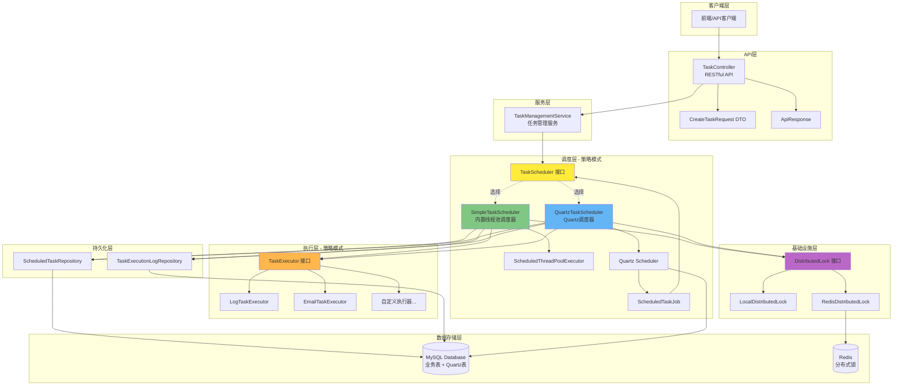

---

## 二、分层架构详解

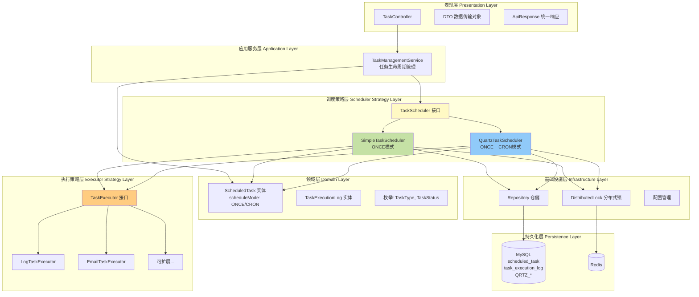

---

## 三、核心类关系图

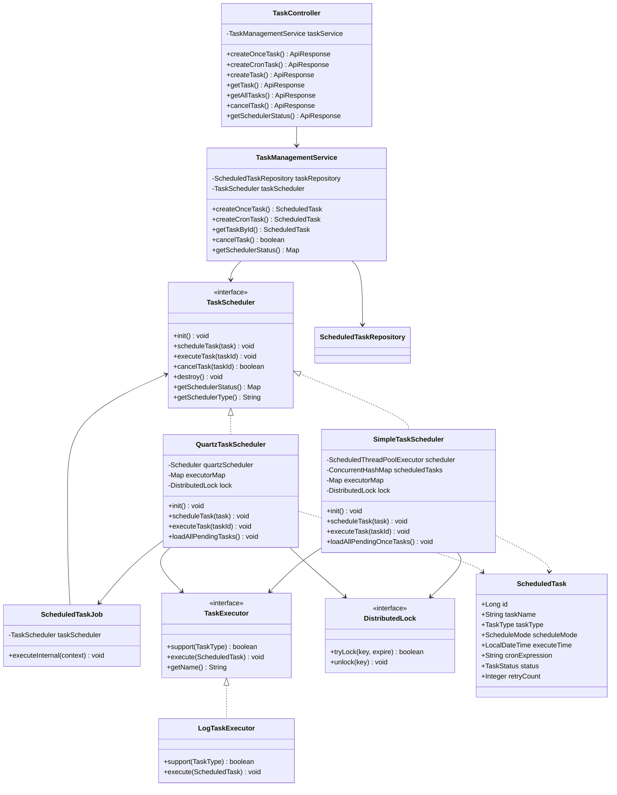

---

## 四、任务创建流程

### ONCE 模式（一次性任务）

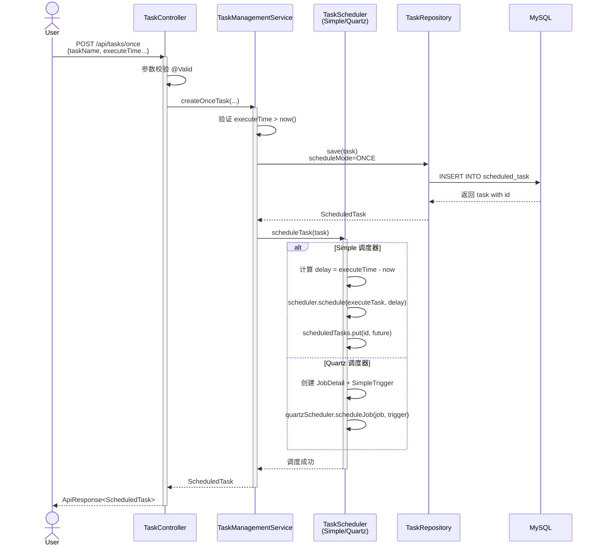

### CRON 模式（周期性任务，仅 Quartz）

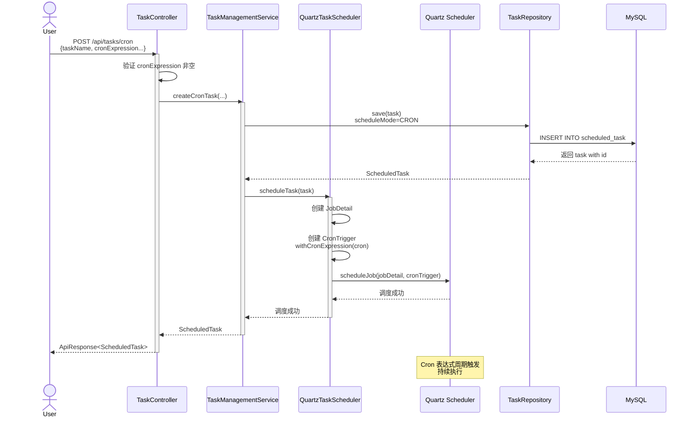

---

## 五、任务执行流程

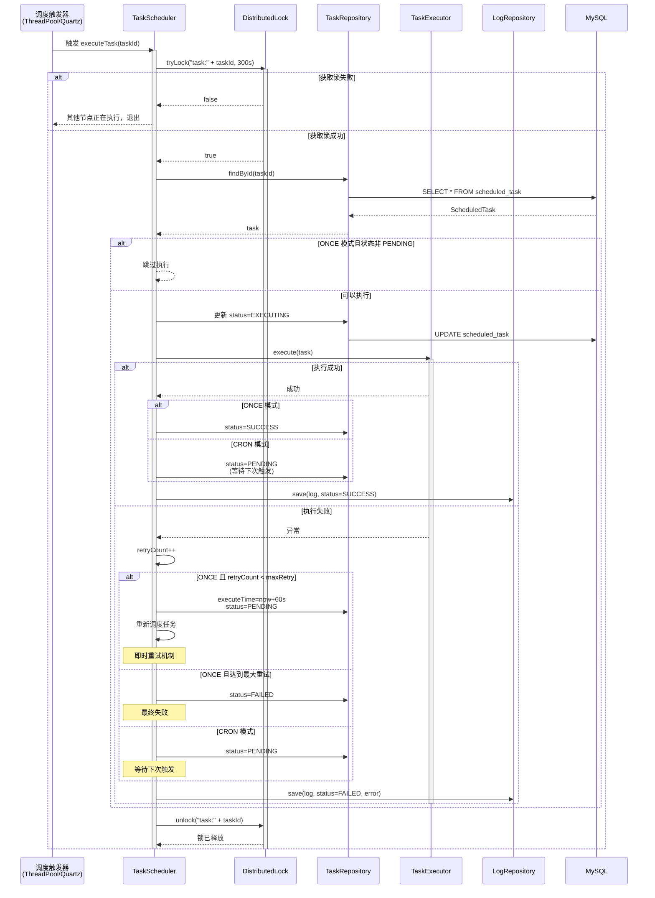

---

## 六、调度器选择机制

```mermaid
flowchart TD
    Start([应用启动]) --> LoadConfig[读取配置<br/>scheduled.task.scheduler-type]
    
    LoadConfig --> CheckType{scheduler-type<br/>值是什么?}
    
    CheckType -->|simple 或未配置| ActivateSimple[@ConditionalOnProperty<br/>havingValue=simple<br/>matchIfMissing=true]
    
    CheckType -->|quartz| ActivateQuartz[@ConditionalOnProperty<br/>havingValue=quartz]
    
    ActivateSimple --> CreateSimple[创建 SimpleTaskScheduler Bean]
    ActivateQuartz --> CreateQuartz[创建 QuartzTaskScheduler Bean]
    
    CreateSimple --> InitSimple[初始化线程池<br/>加载 ONCE 任务]
    CreateQuartz --> InitQuartz[初始化 Quartz<br/>加载 ONCE + CRON 任务]
    
    InitSimple --> RegisterService[注册到 TaskManagementService]
    InitQuartz --> RegisterService
    
    RegisterService --> Ready([系统就绪<br/>接收任务请求])
    
    style CheckType fill:#fff9c4
    style CreateSimple fill:#c5e1a5
    style CreateQuartz fill:#90caf9
    style Ready fill:#a5d6a7
```

---

## 七、调度器对比架构

### Simple 调度器架构

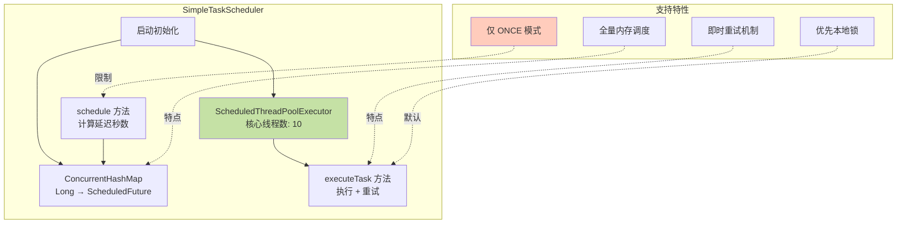

### Quartz 调度器架构

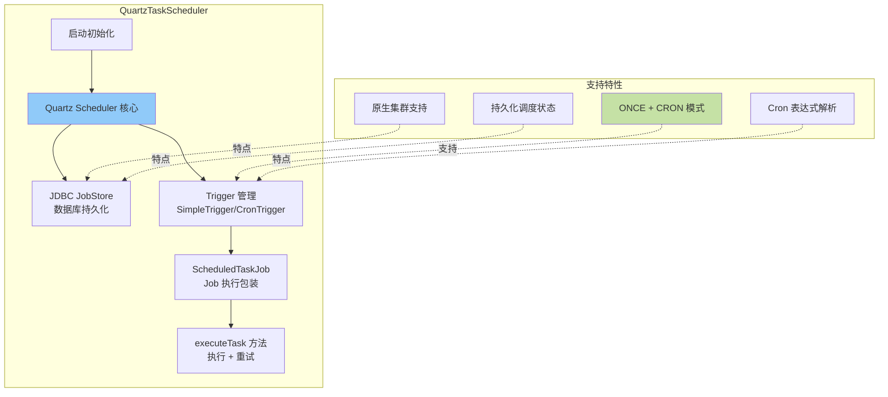

---

## 八、数据库 ER 图

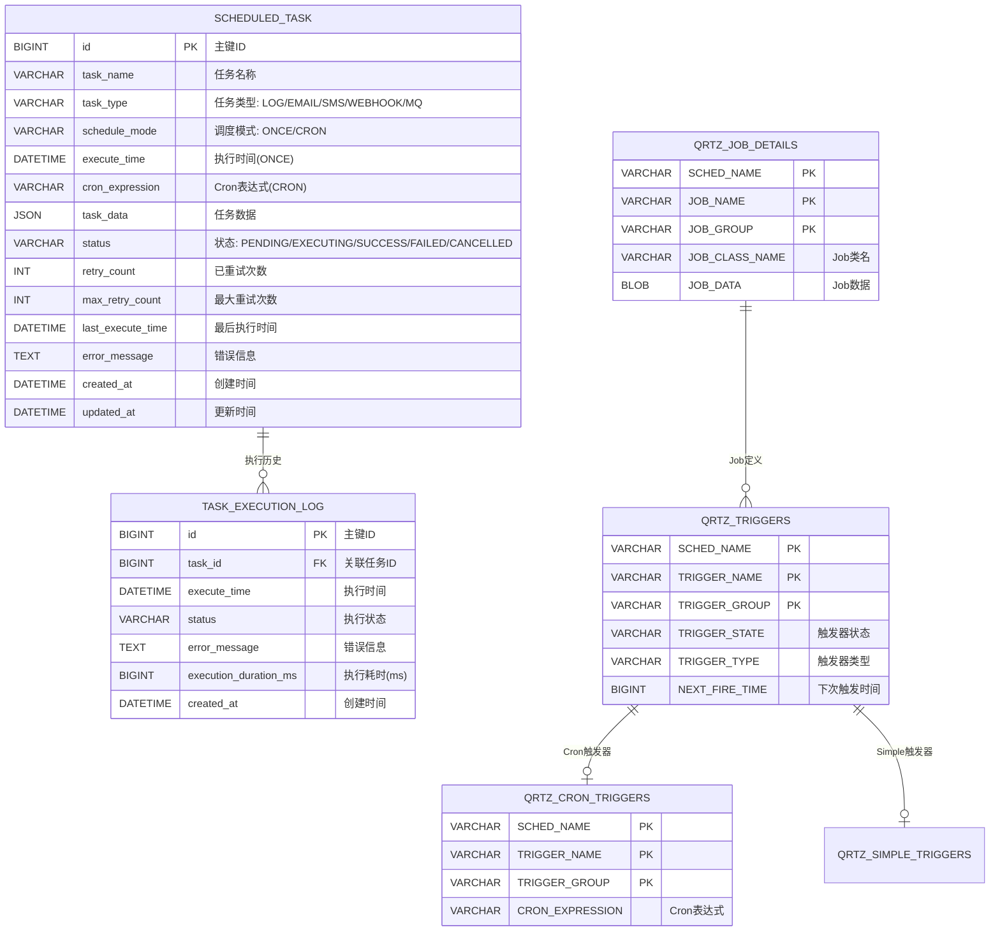

---

## 九、部署架构图

### 单机部署 - Simple 调度器

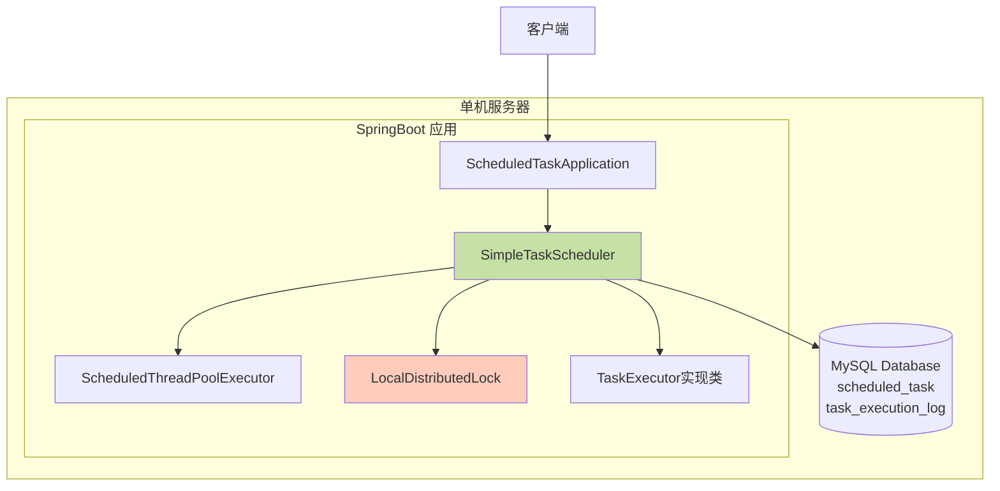

### 集群部署 - Quartz 调度器

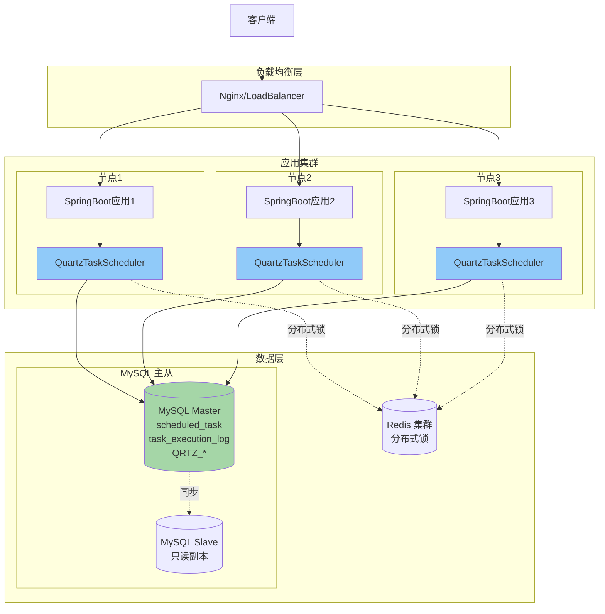

---

## 十、系统状态流转图

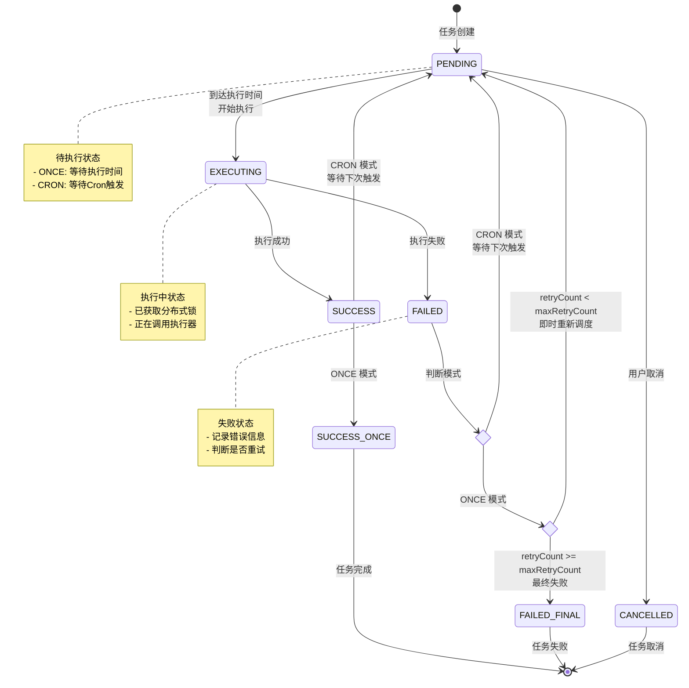

---

## 十一、核心设计模式

### 1. 策略模式 - 调度器切换

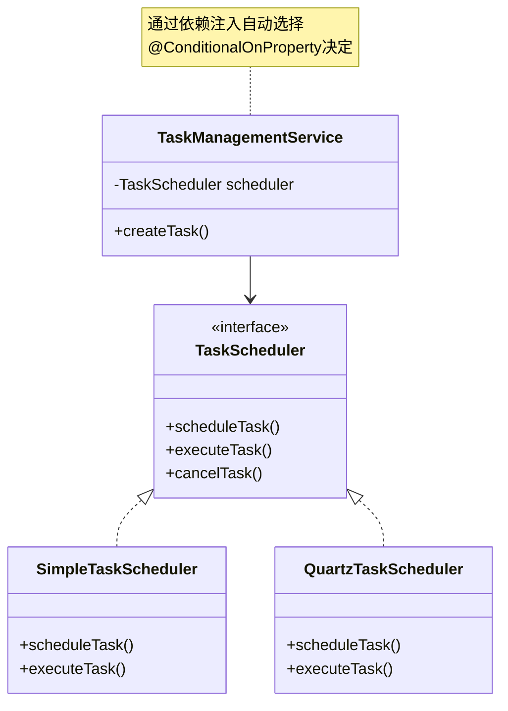

### 2. 策略模式 - 执行器扩展

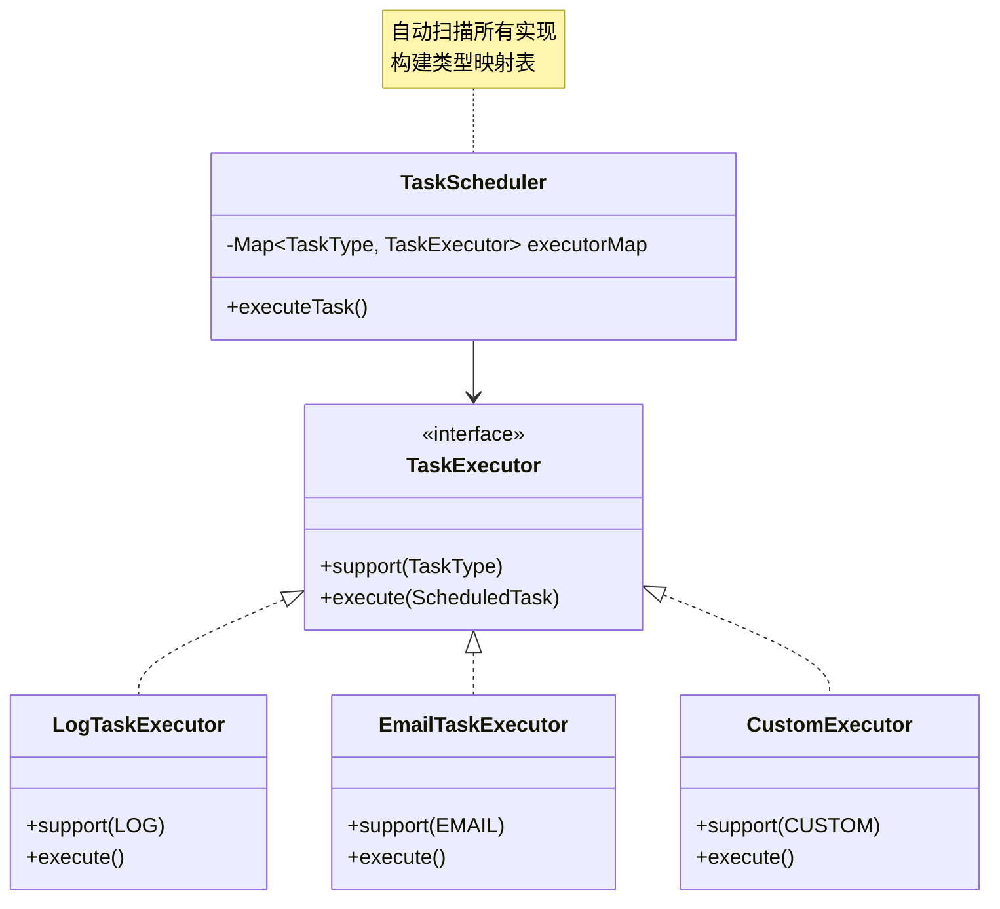

---

## 十二、关键技术决策

### 1. 为什么需要两种调度器？

| 场景 | 推荐调度器 | 原因 |
|------|-----------|------|
| 一次性定时任务 | Simple | 轻量、快速、无额外依赖 |
| 周期性 Cron 任务 | Quartz | 原生支持 Cron 表达式 |
| 小规模（< 1000 任务） | Simple | 内存占用小、启动快 |
| 大规模（> 1000 任务） | Quartz | 数据库持久化、集群支持 |
| 单机部署 | Simple | 简单直接 |
| 集群部署 | Quartz | 原生集群协调 |

### 2. 数据持久化策略

- **业务数据**：统一存储在 `scheduled_task` 和 `task_execution_log` 表
- **调度状态**：
  - Simple：内存中管理（重启恢复）
  - Quartz：持久化到 `QRTZ_*` 表（支持集群）

### 3. 分布式锁设计

```java
// 两种调度器共享锁接口
public interface DistributedLock {
    boolean tryLock(String lockKey, long expireSeconds);
    void unlock(String lockKey);
}

// 防止集群环境下任务重复执行
if (!distributedLock.tryLock("task:" + taskId, 300)) {
    return; // 其他节点正在执行
}
```

### 4. 即时重试机制

```java
// 失败后立即重新调度，无需等待周期扫描
if (retryCount < maxRetryCount) {
    task.setExecuteTime(now.plusSeconds(60));
    task.setStatus(PENDING);
    scheduleTask(task); // 立即加入调度队列
}
```

---

## 十三、监控和运维

### 调度器状态监控

```bash
GET /api/tasks/scheduler/status
```

**Simple 调度器指标**：
- `activeCount`: 当前执行中的任务数
- `poolSize`: 线程池大小
- `queueSize`: 等待队列长度
- `scheduledTaskCount`: 已调度任务数
- `completedTaskCount`: 已完成任务数

**Quartz 调度器指标**：
- `numberOfJobsExecuted`: 执行总数
- `isStarted`: 是否启动
- `isInStandbyMode`: 是否待机
- `runningSince`: 运行开始时间

### 告警规则

- `queueSize > 100`: 任务堆积
- `activeCount == poolSize`: 线程池满载
- 执行失败率 > 10%: 系统异常

---

## 总结

本系统采用**双调度器架构**，通过**策略模式**实现灵活切换：

- ✅ **Simple 调度器**：轻量级、快速启动、适合简单场景
- ✅ **Quartz 调度器**：功能强大、支持 Cron、适合复杂调度
- ✅ **无缝切换**：配置文件一键切换，数据不丢失
- ✅ **高扩展性**：执行器策略模式，易于扩展新功能
- ✅ **生产就绪**：分布式锁、失败重试、集群支持

**架构优势**：
1. 简单场景不引入重量级依赖
2. 复杂需求可平滑升级
3. 统一接口保证代码一致性
4. 策略模式保证扩展性
