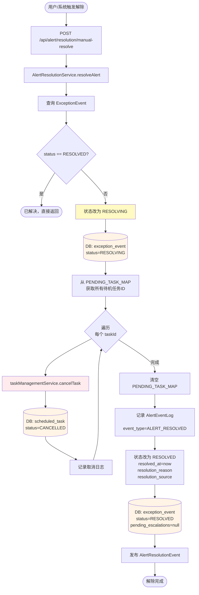
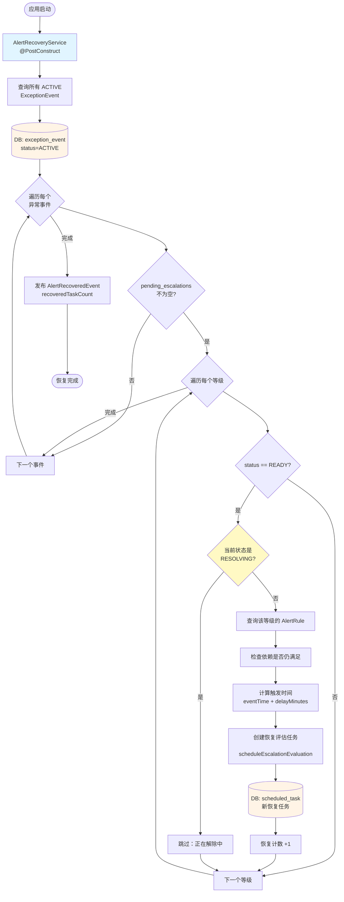
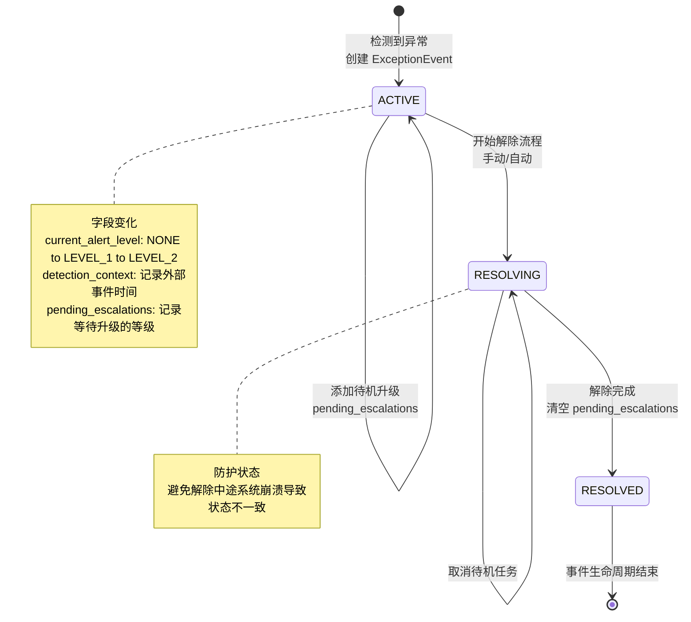
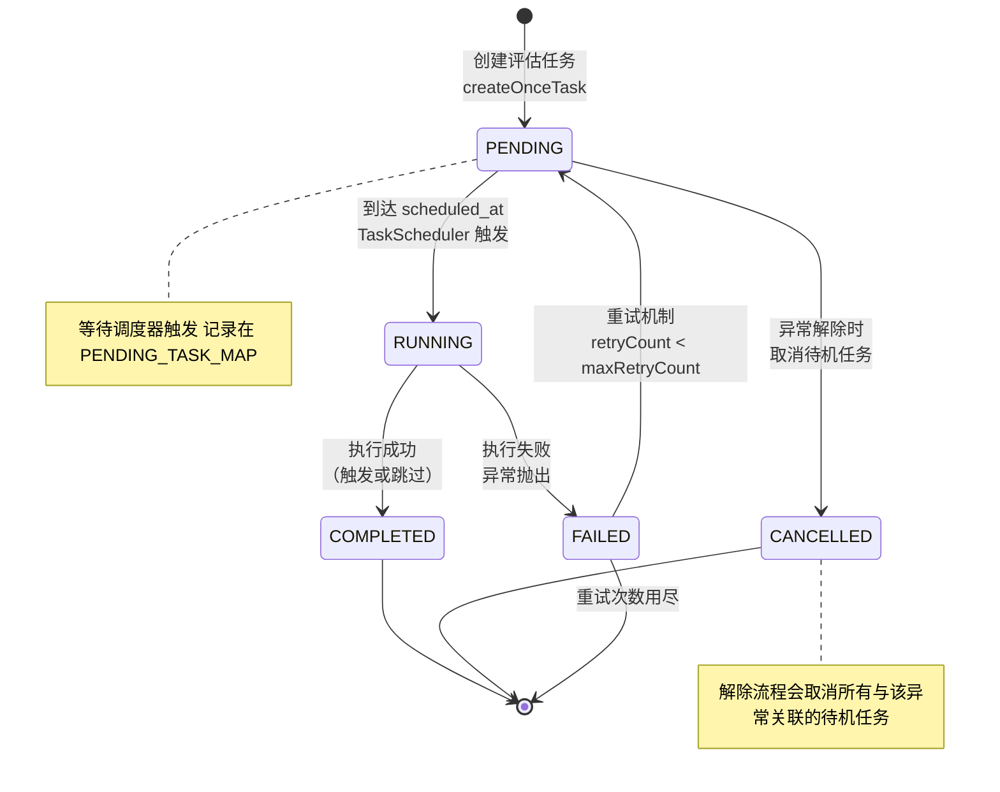
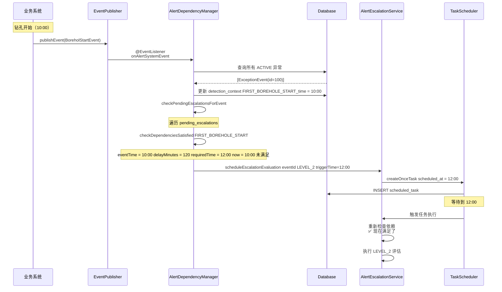
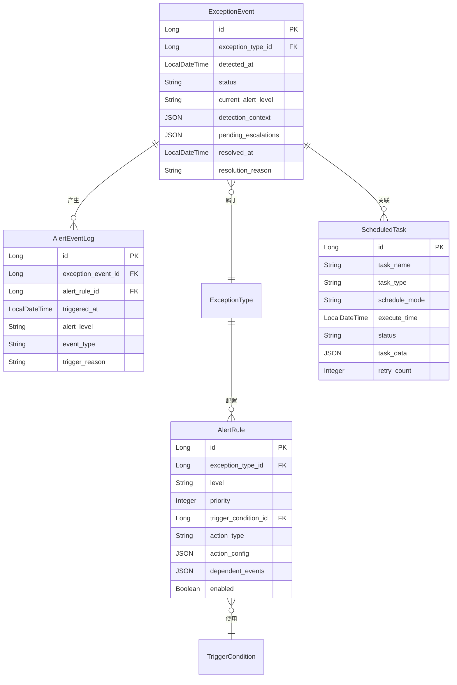

# Alert 系统完整数据流图

本文档包含 Alert 系统的完整数据流图，使用 Mermaid 语法绘制，可在 VS Code 中预览或导出为 SVG 导入 Figma。

## 使用方法

1. **VS Code 预览**：安装 "Markdown Preview Mermaid Support" 插件
2. **在线预览**：复制代码到 https://mermaid.live
3. **导出图片**：在线工具可导出 SVG/PNG 格式

---

## 1. 核心数据流 - 完整生命周期

```mermaid
flowchart TB
    Start([业务系统检测到异常]) --> CreateEvent[创建 ExceptionEvent]
    CreateEvent --> InitDB[("DB: exception_event
    status=ACTIVE
    current_alert_level=NONE")]
    InitDB --> ScheduleInit[调用 scheduleInitialEvaluation]
    
    ScheduleInit --> QueryRules["查询所有启用的 AlertRule
    按等级排序"]
    QueryRules --> GetLowest[获取最低等级规则]
    GetLowest --> CalcTime["计算首次评估时间
    TriggerStrategy.calculateNextEvaluationTime"]
    CalcTime --> CreateTask["创建 ScheduledTask
    taskData: exceptionEventId, alertRuleId"]
    CreateTask --> TaskDB[("DB: scheduled_task
    status=PENDING
    scheduled_at=评估时间")]
    TaskDB --> RecordPending[记录到 PENDING_TASK_MAP]
    
    RecordPending --> WaitTime{"等待到
    scheduled_at"}
    WaitTime -->|时间到达| ExecutorTrigger["TaskScheduler 触发
    AlertExecutor.execute"]
    
    ExecutorTrigger --> LoadEvent[加载 ExceptionEvent]
    LoadEvent --> LoadRule[加载 AlertRule]
    LoadRule --> LoadType[加载 ExceptionType]
    LoadType --> CheckActive{"业务检测
    isExceptionStillActive?"}
    
    CheckActive -->|异常已恢复| SkipEval[跳过评估，返回]
    CheckActive -->|异常仍存在| CheckResolved{"状态是否
    RESOLVED?"}
    
    CheckResolved -->|已解决| SkipEval
    CheckResolved -->|未解决| LoadCondition[加载 TriggerCondition]
    LoadCondition --> ShouldTrigger{"strategy.shouldTrigger
    条件满足?"}
    
    ShouldTrigger -->|否| CalcNext[计算下次评估时间]
    CalcNext --> LogWait[记录日志：继续等待]
    LogWait --> EndNotTriggered([结束 - 未触发])
    
    ShouldTrigger -->|是| LogEvent["记录 AlertEventLog
    event_type=ALERT_TRIGGERED"]
    LogEvent --> ExecAction["执行报警动作
    邮件/短信/Webhook"]
    ExecAction --> UpdateLevel["更新 ExceptionEvent
    current_alert_level=当前等级
    last_escalated_at=now"]
    UpdateLevel --> UpdateDB[("DB: exception_event
    current_alert_level 已更新")]
    UpdateDB --> CheckNext{"是否有
    更高等级规则?"}
    
    CheckNext -->|否| EndMaxLevel([结束 - 已达最高等级])
    CheckNext -->|是| GetNextRule[获取下一等级规则]
    GetNextRule --> CheckDep{"规则有
    依赖事件?"}
    
    CheckDep -->|无依赖| CreateNextTask[直接创建下一等级评估任务]
    CreateNextTask --> WaitTime
    
    CheckDep -->|有依赖| CheckDepMet{"detection_context
    中依赖事件
    已发生?"}
    
    CheckDepMet -->|是| CheckDelay{"delayMinutes
    已满足?"}
    CheckDelay -->|是| CreateNextTask
    CheckDelay -->|否| ScheduleDelayed["安排延时评估任务
    triggerTime = eventTime + delayMinutes"]
    ScheduleDelayed --> WaitTime
    
    CheckDepMet -->|否| RecordWaiting["记录 pending_escalations
    status=WAITING"]
    RecordWaiting --> PendingDB[("DB: exception_event
    pending_escalations JSON")]
    PendingDB --> WaitExternal([等待外部事件])
    
    WaitExternal --> ExternalEvent["业务系统发布
    AlertSystemEvent"]
    ExternalEvent --> DependencyMgr["AlertDependencyManager
    监听事件"]
    DependencyMgr --> RecordContext["记录到 detection_context
    EVENTTYPE_time=now"]
    RecordContext --> ContextDB[("DB: exception_event
    detection_context 已更新")]
    ContextDB --> CheckPending[检查所有 pending_escalations]
    CheckPending --> CheckDepMet
    
    style CreateEvent fill:#e1f5ff
    style InitDB fill:#fff4e6
    style TaskDB fill:#fff4e6
    style UpdateDB fill:#fff4e6
    style PendingDB fill:#fff4e6
    style ContextDB fill:#fff4e6
    style ExecAction fill:#ffe6e6
    style LogEvent fill:#e8f5e9
```

---

## 2. 报警解除流程

---

## 3. 启动恢复流程

---

## 4. 数据库状态转换图

---

## 5. 任务生命周期状态图

---

## 6. 依赖事件处理详细流程

---

## 7. 核心实体关系图

---

## 8. 时间轴视图 - 完整场景示例

```mermaid
gantt
    title Alert 系统完整生命周期时间轴
    dateFormat HH:mm
    axisFormat %H:%M
    
    section 异常事件
    异常检测 ACTIVE            :active, event1, 08:00, 0m
    LEVEL_1 触发               :crit, event2, 08:30, 0m
    等待外部事件               :event3, 08:30, 90m
    外部事件发生               :milestone, event4, 10:00, 0m
    等待延时满足               :event5, 10:00, 15m
    手动解除 RESOLVED          :done, event6, 10:15, 0m
    
    section 调度任务
    创建 task_001 LEVEL_1      :task1, 08:00, 30m
    task_001 执行              :crit, task2, 08:30, 0m
    创建 LEVEL_2 待机          :task3, 08:30, 0m
    记录 pending_escalations   :task4, 08:30, 90m
    task_001 取消              :done, task5, 10:15, 0m
    
    section 依赖事件
    等待 FIRST_BOREHOLE        :dep1, 08:30, 90m
    FIRST_BOREHOLE 发生        :milestone, dep2, 10:00, 0m
    更新 detection_context     :active, dep3, 10:00, 0m
    检查 delayMinutes          :dep4, 10:00, 15m
    
    section 数据库状态
    status ACTIVE              :db1, 08:00, 135m
    current_alert_level LEVEL_1:db2, 08:30, 105m
    detection_context 更新     :active, db3, 10:00, 15m
    status RESOLVING           :crit, db4, 10:15, 0m
    status RESOLVED            :done, db5, 10:15, 0m
```

---

## 9. 关键决策点流程

```mermaid
flowchart TD
    subgraph D1_Group ["决策点 1: 初始评估时机"]
        D1["TriggerStrategy
        calculateNextEvaluationTime"]
        D1 --> D1A{类型}
        D1A -->|绝对时间| D1B[返回指定时刻]
        D1A -->|相对时间| D1C[detected_at + offset]
        D1A -->|周期性| D1D[下一个周期时刻]
    end
    
    subgraph D2_Group ["决策点 2: 触发判定"]
        D2["TriggerStrategy
        shouldTrigger"]
        D2 --> D2A{当前时间}
        D2A -->|在窗口内| D2B[触发]
        D2A -->|在窗口外| D2C[不触发]
    end
    
    subgraph D3_Group ["决策点 3: 依赖检查"]
        D3[checkDependenciesSatisfied]
        D3 --> D3A{事件已发生?}
        D3A -->|否| D3B[进入 WAITING]
        D3A -->|是| D3C{delayMinutes 满足?}
        D3C -->|否| D3D[安排延时任务]
        D3C -->|是| D3E[立即创建任务]
    end
    
    subgraph D4_Group ["决策点 4: 业务检测"]
        D4[isExceptionStillActive]
        D4 --> D4A{检测策略}
        D4A -->|RECORD_CHECK| D4B[查表验证]
        D4A -->|THRESHOLD_CHECK| D4C[指标验证]
        D4A -->|CUSTOM| D4D[自定义逻辑]
        D4B --> D4E{结果}
        D4C --> D4E
        D4D --> D4E
        D4E -->|仍异常| D4F[继续评估]
        D4E -->|已恢复| D4G[跳过]
    end
    
    style D1B fill:#e8f5e9
    style D2B fill:#e8f5e9
    style D3E fill:#e8f5e9
    style D4F fill:#e8f5e9
    style D2C fill:#ffebee
    style D3B fill:#ffebee
    style D4G fill:#ffebee
```

---

## 使用建议

### 导出到 Figma 的步骤：

1. 打开 https://mermaid.live
2. 粘贴上述任一图表代码
3. 点击右上角 "Actions" → "Export SVG"
4. 在 Figma 中导入 SVG 文件
5. 解组（Ungroup）后可编辑样式、颜色、布局

### 图表说明：

- **图1**: 核心数据流 - 最复杂，包含所有主要路径
- **图2**: 解除流程 - 展示如何清理资源
- **图3**: 启动恢复 - 展示容错机制
- **图4-5**: 状态转换 - 展示生命周期
- **图6**: 时序图 - 展示依赖处理细节
- **图7**: ER图 - 展示数据模型关系
- **图8**: 甘特图 - 展示时间轴
- **图9**: 决策点 - 展示关键判定逻辑

### 自定义提示：

- 修改颜色：`style NodeID fill:#颜色代码`
- 调整布局：改变 `flowchart TB`(上下) 为 `LR`(左右)
- 增加注释：使用 `note` 或 `Note over`
- 简化视图：移除不需要的分支

所有图表代码已保存到文档中，你可以随时修改和扩展！
