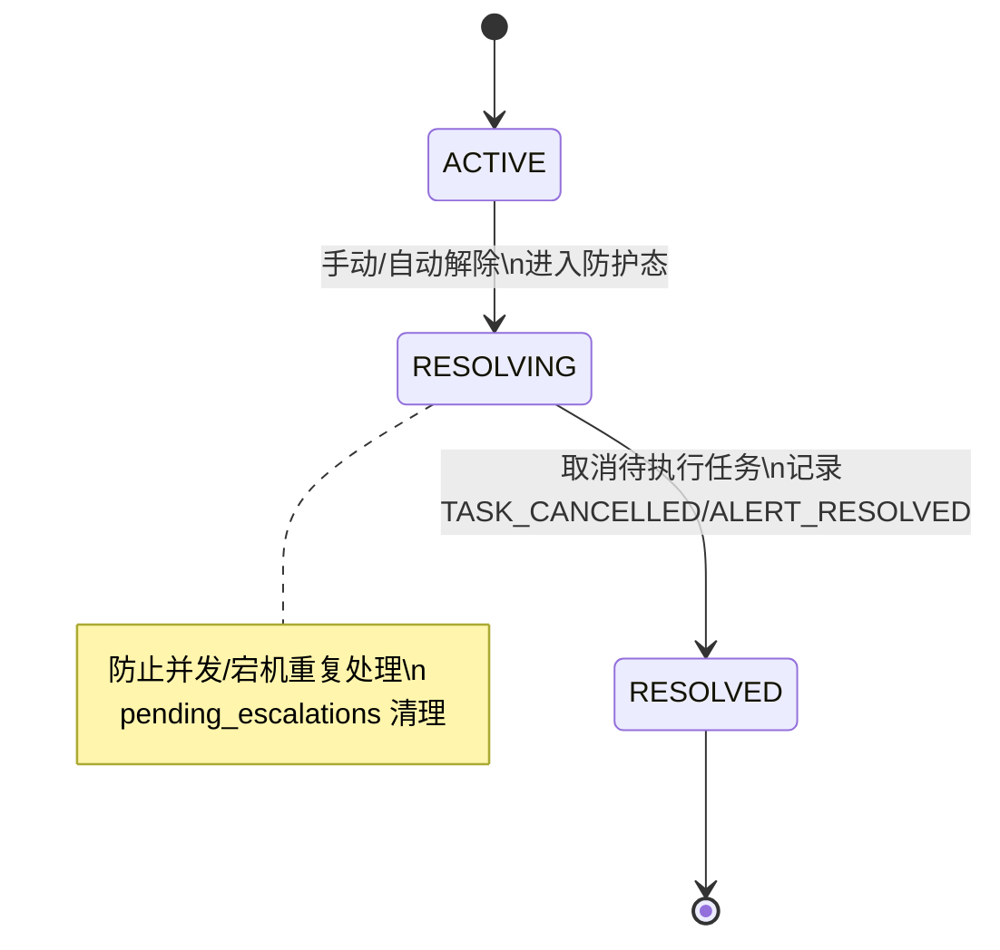
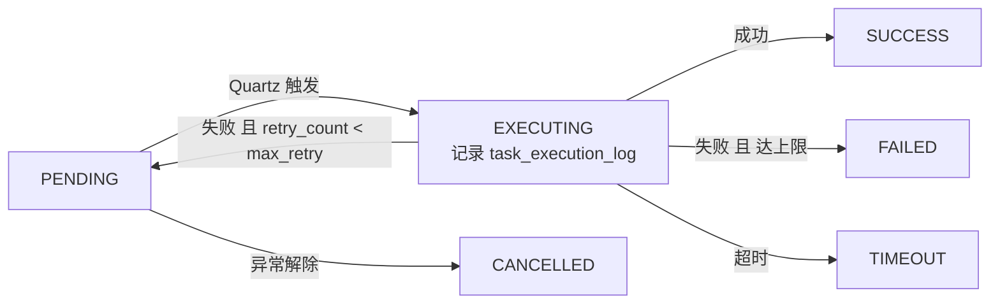
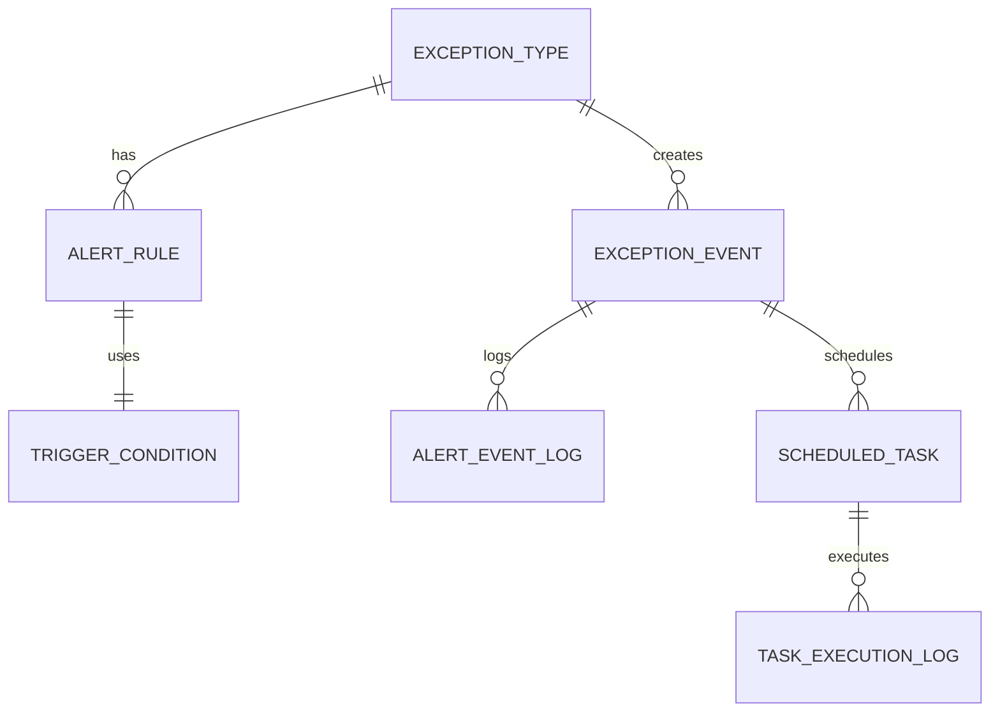

# Alert 系统数据流 Mermaid 版

> 直接可在 Markdown + Mermaid 环境预览（VS Code 插件或 mermaid.live）。

---

## 1) 异常检测→告警→解除全景图
```mermaid
flowchart TD
  A[业务系统] --> B[DetectionService\n查 exception_type 与 detection_config]
  B --> C[创建 exception_event\nstatus=ACTIVE\ncurrent_alert_level=NONE\npending_escalations=空]

  C --> D[AlertManager 选 LEVEL_1 规则]
  D --> E[创建 scheduled_task\nALERT_EVALUATION_eventId_ruleId]
  D --> F[alert_event_log=ALERT_TRIGGERED]

  E -->|定时触发| G[AlertExecutor.execute]
  G -->|条件满足| H[任务 SUCCESS\n写日志]
  H --> I{有下一级?}
  I -->|有依赖| J[更新 pending_escalations[level]=WAITING]
  I -->|无依赖| K[创建下一级 scheduled_task]

  G -->|条件不满足| L[重新计算 execute_time\n回到 PENDING]

  M[外部事件: FIRST_BOREHOLE_START] --> N[AlertDependencyManager]
  N --> O[更新 detection_context]
  N --> P{依赖满足?}
  P -->|是| Q[设 level=READY\n创建该级 scheduled_task]
  P -->|否| R[继续 WAITING]

  S[手动/自动解除] --> T[resolveAlert]
  T --> U[status=RESOLVING]
  T --> V[取消所有 PENDING 任务\n写 TASK_CANCELLED]
  T --> W[status=RESOLVED\npending_escalations=NULL\n写 ALERT_RESOLVED]
```

---

## 2) 多等级依赖与升级流程
```mermaid
flowchart TD
  C0[异常创建\npending_escalations={}] 

  C1[LEVEL_1 评估\nABSOLUTE 16:00] -->|触发| C2[alert_event_log: ALERT_TRIGGERED\ncurrent_alert_level=LEVEL_1]
  C2 --> C3{LEVEL_2 有依赖?}
  C3 -->|是| C4[LEVEL_2: WAITING\n依赖: FIRST_BOREHOLE_START + 延迟]
  C3 -->|否| C5[直接创建 LEVEL_2 任务]

  E0[事件: FIRST_BOREHOLE_START 10:00] --> E1[检查延迟 120 分钟]
  E1 -->|满足| E2[LEVEL_2: READY\n创建 LEVEL_2 任务 (execute_time=NOW 或新延迟)\ntaskId 记录到 pending_escalations]
  E1 -->|不满足| E3[保持 WAITING]

  L2[LEVEL_2 任务执行] -->|条件满足| L3[alert_event_log: ALERT_ESCALATED\ncurrent_alert_level=LEVEL_2]
  L3 --> L4[若有 LEVEL_3 则继续 WAITING/READY 流程]
```

---

## 3) Exception Event 状态机


---

## 4) Scheduled Task 生命周期


---

## 5) 关键 JSON 结构（缩略）
```mermaid
classDiagram
  class detection_context {
    shift_id
    shift_start_time
    team
    FIRST_BOREHOLE_START_time
    BOREHOLE_COMPLETE_time
    OPERATION_END_time
  }

  class pending_escalations {
    LEVEL_X status WAITING|READY
    createdAt
    readyAt
    scheduledTime
    taskId (string)
    dependencies[eventType, delayMinutes, required]
    logicalOperator AND|OR
  }

  class action_config {
    LOG: logLevel, message, includeContext
    EMAIL: recipients[], subject, template, cc[], priority
    SMS: phoneNumbers[], content
    WEBHOOK: url, method, headers{}, timeout, retries
  }

  detection_context --> pending_escalations
  pending_escalations --> action_config : 驱动后续任务/动作
```

---

## 6) 核心表关系简图

