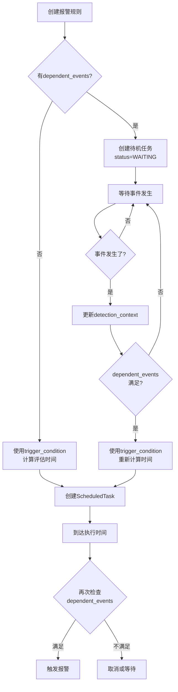

# trigger_condition 与 dependent_events 详解

## 问题

在 `alert_rule` 表中，`trigger_condition` 和 `dependent_events` 这两个字段看起来很相似，都涉及时间和事件，它们有什么区别？

## 一句话总结

- **trigger_condition**：回答"**什么时候检查**" → 计算评估任务的执行时间
- **dependent_events**：回答"**能不能通过**" → 判断报警是否真正触发的前置条件

## 详细对比

### trigger_condition（触发条件）

**目的**：计算评估任务应该在什么时间点执行

**作用时机**：
1. 创建报警规则时
2. 依赖事件发生时（重新计算时间）

**处理逻辑**：
```java
// TriggerStrategy.calculateNextEvaluationTime()
LocalDateTime evaluationTime = calculateBasedOnTriggerCondition();
ScheduledTask task = createTask(evaluationTime);  // 创建定时任务
```

**示例配置**：
```json
{
  "type": "RELATIVE",
  "eventType": "FIRST_BOREHOLE_START",
  "offsetMinutes": 120
}
```

**含义**：
- 基准时间：FIRST_BOREHOLE_START 事件发生的时间
- 偏移量：+120分钟
- 结果：在事件发生后120分钟执行评估任务

**实际效果**：
```
18:00 - FIRST_BOREHOLE_START 事件发生
        ↓
        根据 trigger_condition 计算
        ↓
20:00 - 创建并执行评估任务（18:00 + 120分钟）
```

---

### dependent_events（依赖事件）

**目的**：判断是否满足触发报警的前置条件

**作用时机**：
1. 创建待机任务时（设置为 WAITING 状态）
2. 事件发生时（检查是否满足条件）
3. 评估任务执行时（最终判断）

**处理逻辑**：
```java
// AlertDependencyManager.checkDependenciesSatisfied()
if (!checkDependentEvents()) {
    status = "WAITING";  // 继续等待
    return;
}
// 依赖满足，可以触发报警
triggerAlert();
```

**示例配置**：
```json
{
  "logicalOperator": "AND",
  "events": [
    {
      "eventType": "FIRST_BOREHOLE_START",
      "delayMinutes": 120,
      "required": true
    }
  ]
}
```

**含义**：
- 必须发生的事件：FIRST_BOREHOLE_START
- 延迟要求：事件发生后必须过120分钟
- 必要性：required=true，不满足则不触发

**实际效果**：
```
16:00 - 评估时间到了
        ↓
        检查 dependent_events
        ↓
        FIRST_BOREHOLE_START 未发生 ❌
        ↓
        状态设为 WAITING，不触发报警
        
18:00 - FIRST_BOREHOLE_START 事件发生
        ↓
        检查 dependent_events
        ↓
        事件已发生，但需要等120分钟 ⏱️
        ↓
        重新调度到 20:00
        
20:00 - 评估任务执行
        ↓
        检查 dependent_events
        ↓
        事件已发生且过了120分钟 ✅
        ↓
        触发报警
```

---

## 核心区别表

| 维度 | trigger_condition | dependent_events |
|------|------------------|------------------|
| **回答的问题** | "什么时候检查？" | "检查时能不能通过？" |
| **作用对象** | ScheduledTask（定时任务） | 报警触发判断 |
| **计算内容** | 时间点（LocalDateTime） | 布尔值（true/false） |
| **必填性** | 必填 | 可选 |
| **没有配置时** | 无法创建规则 | 立即触发，无等待 |
| **数据来源** | detection_context | detection_context |
| **影响状态** | 无 | pending_escalations 状态 |
| **处理服务** | TriggerStrategy | AlertDependencyManager |

---

## 实战案例

### 案例1：简单固定时间报警

**需求**：每天16:00检查入井记录，不需要任何依赖

**配置**：
```json
{
  "level": "LEVEL_1",
  "trigger_condition": {
    "type": "ABSOLUTE",
    "time": "16:00"
  },
  "dependent_events": null  // 无依赖
}
```

**工作流程**：
```
16:00 → trigger_condition 计算到时间了
     → 执行评估任务
     → 没有 dependent_events 检查
     → 直接触发报警
```

---

### 案例2：依赖业务事件的报警

**需求**：第一个钻孔开始后2小时，如果入井记录仍然不足，触发报警

**配置**：
```json
{
  "level": "LEVEL_2",
  "trigger_condition": {
    "type": "RELATIVE",
    "eventType": "FIRST_BOREHOLE_START",
    "offsetMinutes": 120
  },
  "dependent_events": {
    "logicalOperator": "AND",
    "events": [
      {
        "eventType": "FIRST_BOREHOLE_START",
        "delayMinutes": 120,
        "required": true
      }
    ]
  }
}
```

**工作流程**：
```
14:00 异常检测到
      ↓
      创建 LEVEL_2 待机任务
      status = "WAITING"（因为有 dependent_events）
      
18:00 FIRST_BOREHOLE_START 事件发生
      ↓
      AlertDependencyManager 收到事件
      ↓
      更新 detection_context: {"FIRST_BOREHOLE_START_time": "18:00"}
      ↓
      检查 dependent_events：事件已发生 ✅
      ↓
      使用 trigger_condition 计算时间：18:00 + 120分钟 = 20:00
      ↓
      创建 ScheduledTask，执行时间 = 20:00
      status = "READY"
      
20:00 评估任务执行
      ↓
      再次检查 dependent_events：
      - FIRST_BOREHOLE_START 在 18:00 发生 ✅
      - 现在是 20:00，已过120分钟 ✅
      ↓
      检查业务条件：入井记录仍不足 ✅
      ↓
      触发 LEVEL_2 报警
```

**关键理解**：
- `trigger_condition` 告诉系统"在20:00执行检查"
- `dependent_events` 告诉系统"检查时必须确认事件已发生且过了2小时"

---

### 案例3：复杂依赖（OR逻辑）

**需求**：等待"第一个钻孔开始"或"班次结束"任一事件发生

**配置**：
```json
{
  "trigger_condition": {
    "type": "RELATIVE",
    "eventType": "SHIFT_END",
    "offsetMinutes": 0
  },
  "dependent_events": {
    "logicalOperator": "OR",
    "events": [
      {"eventType": "FIRST_BOREHOLE_START", "required": true},
      {"eventType": "SHIFT_END", "required": true}
    ]
  }
}
```

**工作流程**：
```
情况A：钻孔先发生
  18:00 FIRST_BOREHOLE_START → dependent_events 满足 → 触发

情况B：班次先结束
  22:00 SHIFT_END → dependent_events 满足 → 触发
  
情况C：都不发生
  → status 保持 WAITING → 不触发
```

---

## 特殊配置分析

### 配置1：只有 trigger_condition

```json
{
  "trigger_condition": {"type": "ABSOLUTE", "time": "16:00"},
  "dependent_events": null
}
```

**行为**：
- ✅ 16:00 准时触发
- ✅ 无需等待任何事件
- ✅ 适合固定时间检查的场景

---

### 配置2：trigger_condition 和 dependent_events 引用不同事件

```json
{
  "trigger_condition": {
    "type": "RELATIVE",
    "eventType": "SHIFT_START",
    "offsetMinutes": 480  // 班次开始后8小时
  },
  "dependent_events": {
    "events": [
      {"eventType": "FIRST_BOREHOLE_START", "required": true}
    ]
  }
}
```

**行为**：
```
08:00 SHIFT_START 发生
      ↓
      trigger_condition 计算：08:00 + 480分钟 = 16:00
      ↓
      但 dependent_events 需要 FIRST_BOREHOLE_START
      ↓
      如果 16:00 前钻孔未开始 → WAITING
      ↓
10:00 FIRST_BOREHOLE_START 发生
      ↓
      dependent_events 满足
      ↓
      但 trigger_condition 已经算出 16:00
      ↓
      所以仍在 16:00 执行评估
```

**关键**：`trigger_condition` 决定时间，`dependent_events` 决定是否允许

---

### 配置3：dependent_events 有延迟

```json
{
  "trigger_condition": {
    "type": "RELATIVE",
    "eventType": "FIRST_BOREHOLE_START",
    "offsetMinutes": 60  // 事件后1小时
  },
  "dependent_events": {
    "events": [
      {
        "eventType": "FIRST_BOREHOLE_START",
        "delayMinutes": 120  // 事件后2小时
      }
    ]
  }
}
```

**分析**：
```
18:00 FIRST_BOREHOLE_START 发生
      ↓
      trigger_condition：18:00 + 60分钟 = 19:00
      dependent_events：需要等到 18:00 + 120分钟 = 20:00
      ↓
19:00 评估任务执行
      ↓
      检查 dependent_events：还没到2小时 ❌
      ↓
      不触发，重新调度到 20:00
      
20:00 重新评估
      ↓
      dependent_events 满足 ✅
      ↓
      触发报警
```

**结论**：两者都配置时，**以延迟更长的为准**

---

## 数据流程图



---

## 最佳实践

### 1. 固定时间报警（无依赖）
```json
{
  "trigger_condition": {"type": "ABSOLUTE", "time": "16:00"},
  "dependent_events": null
}
```
→ 适用于每日例行检查

### 2. 事件后延迟报警（有依赖）
```json
{
  "trigger_condition": {
    "type": "RELATIVE",
    "eventType": "SHIFT_START",
    "offsetMinutes": 480
  },
  "dependent_events": {
    "events": [
      {"eventType": "SHIFT_START", "delayMinutes": 480}
    ]
  }
}
```
→ 适用于"班次开始8小时后检查"

### 3. 等待某个事件（但时间也很重要）
```json
{
  "trigger_condition": {
    "type": "RELATIVE",
    "eventType": "FIRST_BOREHOLE_START",
    "offsetMinutes": 120
  },
  "dependent_events": {
    "events": [
      {"eventType": "FIRST_BOREHOLE_START", "required": true}
    ]
  }
}
```
→ 适用于"必须等事件发生，然后延迟触发"

---

## 总结

**记住三个关键点**：

1. **trigger_condition = 时钟**
   - 回答"几点钟"执行评估
   - 计算 ScheduledTask 的执行时间

2. **dependent_events = 门禁**
   - 回答"能不能进"
   - 判断是否允许触发报警

3. **配合使用 = 精确控制**
   - trigger_condition 计算时间
   - dependent_events 控制条件
   - 两者结合实现"在正确的时间、正确的条件下"触发报警

**一句话区分**：
> `trigger_condition` 是"预约时间"，`dependent_events` 是"入场券"  
> 时间到了（trigger_condition），但没有票（dependent_events），进不去！
